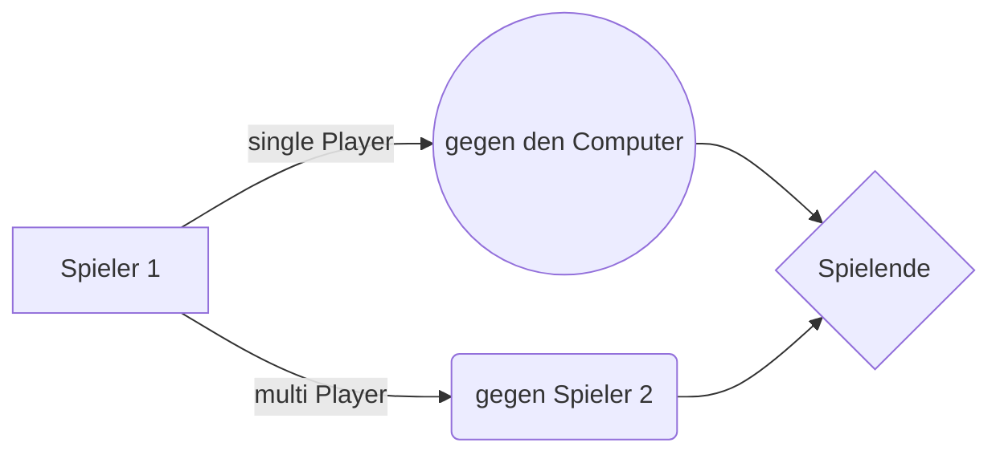

# Willkommen im Rechenlernspiel!

Es handelt sich hier um ein Projekt, welches im Rahmen des Kotlin Grundlagenkurses
beim **Syntax Institut** von mir erarbeitet wurde.
Ein **einfaches** Rechenlernpiel auf Grundschulniveau mit den Grundrechenarten 
im Zahlenrahmen bis 100.

# Klassen

- **Rechnung** und die erbenden Klassen für die verschiedenen Rechenarten.
- **Player** und die erbende Klassen für den Computer als Player.

#

# Spielmöglichkeiten

#

# Ein Projekt von: Kevin Michallik - 02.2023
